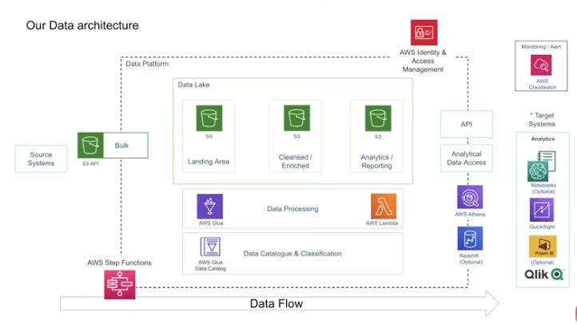
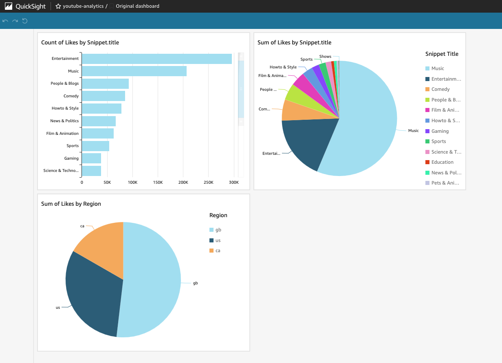

# Data Engineering YouTube Analysis Project 

## **Overview**

This project aims to securely manage, streamline, and perform analysis on the structured and semi-structured YouTube videos data based on the video categories and the trending metrics.

## **Project Goals**

- Data Ingestion — Build a mechanism to ingest data from different sources
- ETL System — We are getting data in raw format, transforming this data into the proper format
- Data lake — We will be getting data from multiple sources so we need centralized repo to store them
- Scalability — As the size of our data increases, we need to make sure our system scales with it
- Cloud — We can’t process vast amounts of data on our local computer so we need to use the cloud, in this case, we will use AWS
- Reporting — Build a dashboard to get answers to the question we asked earlier

## **Services we will be using**

- Amazon S3: Amazon S3 is an object storage service that provides manufacturing scalability, data availability, security, and performance.
- AWS IAM: This is nothing but identity and access management which enables us to manage access to AWS services and resources securely.
- QuickSight: Amazon QuickSight is a scalable, serverless, embeddable, machine learning-powered business intelligence (BI) service built for the cloud.
- AWS Glue: A serverless data integration service that makes it easy to discover, prepare, and combine data for analytics, machine learning, and application development.
- AWS Lambda: Lambda is a computing service that allows programmers to run code without creating or managing servers.
- AWS Athena: Athena is an interactive query service for S3 in which there is no need to load data it stays in S3.

## **Dataset Used**

This Kaggle dataset contains statistics (CSV files) on daily popular YouTube videos over the course of many months. There are up to 200 trending videos published every day for many locations. The data for each region is in its own file. The video title, channel title, publication time, tags, views, likes and dislikes, description, and comment count are among the items included in the data. A category_id field, which differs by area, is also included in the JSON file linked to the region.

## **Architecture Diagram**

## **Quicksight Dashboard**

## **Prerequisites**

Python , AWS s3, AWS glue crawler ( the crawler scans the data in S3, infers the schema and creates a table in glue catalog) , AWS Athena, AWS Lambda, Quicksight

## **Key points**

An error occureded while uploading files into S3 bucket - An error occurred (AccessDenied) when calling the CreateMultipartUpload operation: Access Denied

Resolutions

Workaround is to avoid multi-part uploads, by either:

    Increase your triggering limit for s3 cp command from the default 8MB to higher, e.g. 5GB https://docs.aws.amazon.com/cli/latest/topic/s3-config.html
    Use aws s3api put-object instead - it doesn't automatically switch to multi-part uploads.

Multi-part uploads are auto-enabled in s3 cp for performance and fault-tolerancy.

AWS glue needs JSON in one line , so to do that we will convert the JSON file into apache parquet format using aws lambda

IAM permission errors needs to be resolved

When selecting crawler , select the subfolder with the files

Parquet file comes with metadata , when we change the datatype inside aws catalog it does not change the datatype

